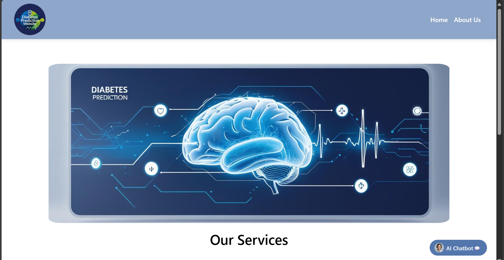
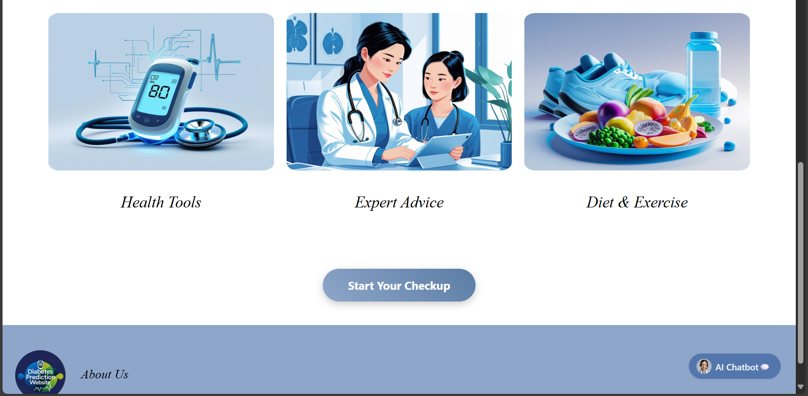
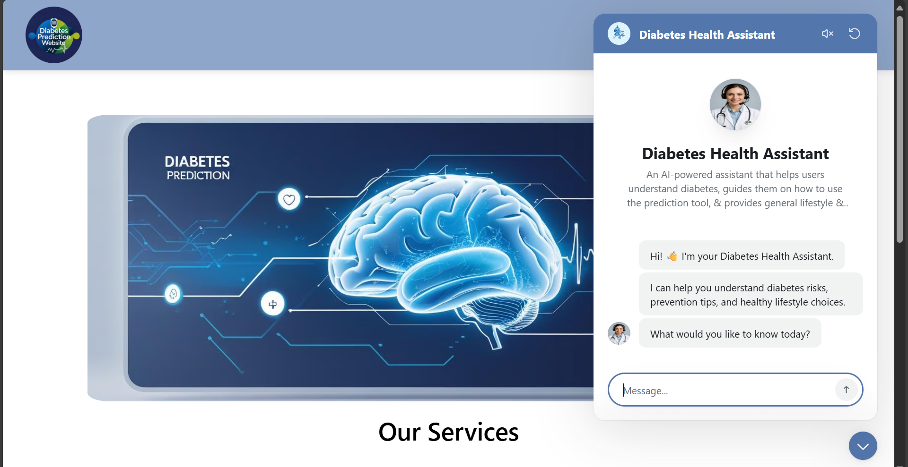
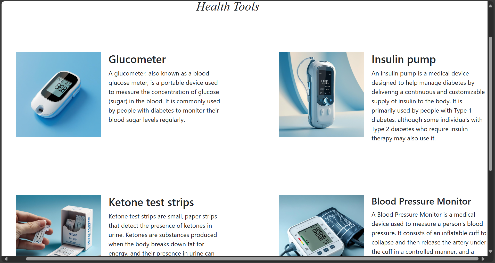
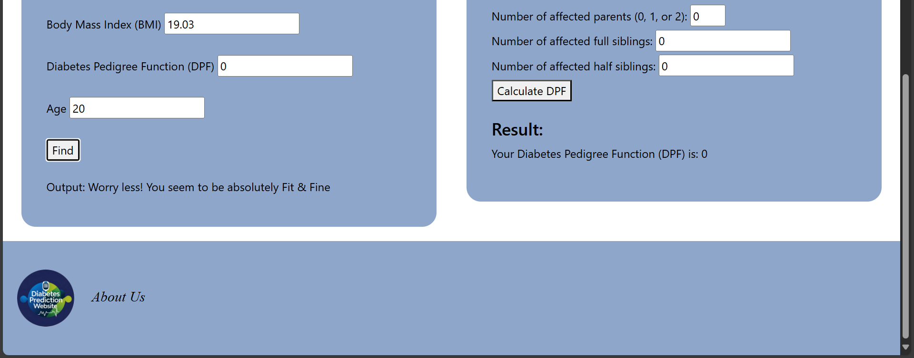

# 🩺 Diabetes Prediction Web Application with AI Chatbot  

A machine learning–based web application that predicts **diabetes risk** based on user health data.
Also provides an **AI chatbot assistant** for interactive guidance.  

---

## ✨ Features
- Predicts diabetes risk using **Support Vector Machine (SVM) model** (`Final2.pkl`)  
- Other trained models: **Logistic Regression, Random Forest**  
- Integrated into a **Flask web app**  
- Interactive front-end built with **HTML/CSS**  
- AI Chatbot built with **Voiceflow**, connected via **Replit backend** to **OpenRouter API**  
- **Health Tools page**: Product buttons redirect users to **Amazon search results** for that product  
- Model serialized with Pickle for deployment  

---

## 📊 Dataset
- **PIMA Indian Diabetes Dataset (`diabetes.csv`)**  
- Includes features such as: Glucose, BMI, Blood Pressure, Insulin, Age, Pregnancies, Diabetes Pedigree Function  
- Data preprocessing performed with **scaling** for better model accuracy  

---

## 🧠 Model Training
- Trained Models:  
  - Logistic Regression  
  - Random Forest  
  - Support Vector Machine (SVM) ✅  

- **Best Model:**  
  - **Support Vector Machine (SVM)** achieved the best performance  
  - Saved as `Final2.pkl` and used in the deployed app  

---

## 💬 AI Chatbot
- **Frontend:** Integrated in the homepage using **Voiceflow**  
- **Backend:** Replit server connects the chatbot to the **OpenRouter API**  
- **Functionality:** Provides answers to user queries related to diabetes, health tips, and lifestyle  

---

## 🛠️ Technologies Used
- **Backend:** Python, Flask  
- **Frontend:** HTML, CSS  
- **ML Libraries:** scikit-learn, pickle  
- **AI Chatbot:** Voiceflow, Replit backend, OpenRouter API  
- **Development:** Jupyter Notebook  

---

## 📸 Screenshots

1. **Homepage**
   
   

2. **🤖 AI Chatbot**
   

3. **Health Tools**
   

4. **Diabetes Checkup Form**
   
   

---

## 📂 Project Structure
```
Diabetes_prediction_project/
│
├── main.py                # Flask app entry point
├── proj2.ipynb            # Jupyter Notebook for training models
├── diabetes.csv           # Dataset (PIMA Indian Diabetes Dataset)
├── Final2.pkl             # SVM model used for prediction
├── scaler.pkl             # Scaler for preprocessing
├── templates/             # HTML frontend
    ├── Home.html          # Homepage with AI chatbot
    ├── Test.html          
    ├── AboutUs.html
    ├── Diet&Exer.html
    ├── ExpertAdv.html
    ├── HealthTools.html
    └── prac.html
├── static/                # CSS, images, and other static assets
    ├── Css/
        ├── index.css
        ├── aboutus.css
        ├── test.css
        └── ...
    ├── image/
        ├── logo.png
        ├── bg.avif
        ├── Homepage.png
        └── ...
└── README.md              # Project documentation
```

---

## 🚀 How to Run

1. Clone this repository  
   ```bash
   git clone https://github.com/SyedAbbas-02/Diabetes_prediction_project.git
   cd Diabetes_prediction_project

2. Install dependencies
    ```bash
    pip install flask
    pip install scikit-learn

3. Run the project
    ```bash
    python main.py

---